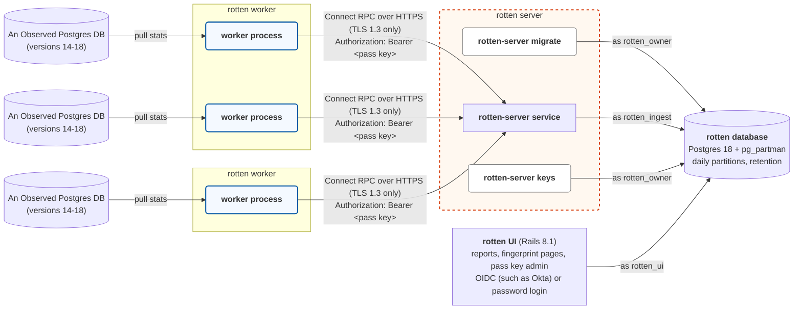

rotten
======

**Requests Over Time, Tracked Easily Now.**

Rotten shows you which queries are hurting your Postgres databases, over any time range you like, without full query logging.

pgBadger is great, but it needs full logging to tell the truth, and full logging is expensive on a busy server (especially when the logs must go to a remote host for compliance). pgBadger reports are also fixed once generated. In contrast, Rotten looks at `pg_stat_statements` every few minutes, records how much each statement's counters grew, and stores that in its own database.

That gets you most of what full logging would, at a fraction of the cost, and you can slice it by time, source, or query context.

Architecture
------------


* **`rotten worker`**: A long-running daemon. Run as many as you would like per server or container. Rotten workers periodically connect to a single DB as `rotten-observer` and use `pg_read_all_stats` to pull from `pg_stat_statements`. Results are compared against a local cache to find changes since the last pull, and new queries are fingerprinted. Also parses marginalia comments to find controller, action and job. Queues up results in a durable SQLite db to be sent to the rotten server.

  On PG 17+, also does a min/max-only reset.
* **`rotten-server service`**: A long-running service which receives stats dumps from rotten workers. Validates the authenticity of each worker using pass keys and pinned FQDNs, and the integrity of the data packet. Dumps each harvest to the Rotten DB in one transaction.
* **`rotten-server migrate`**: An admin command to apply pending migrations to the Rotten DB.
* **`rotten-server keys`**: Ad admin command to manage keys for rotten workers.
  
Workers reach the server but never the rotten database. The server and UI
share only the database. The SQL behind every report is in `reports/`, and
you can run it yourself in psql as `rotten_readonly`.

Quick start
-----------

The dev stack runs everything in Docker: an observed Postgres 18 and a
streaming replica, a worker for each, the server, the rotten database and
the UI.

```sh
docker compose -f dev/docker-compose.yaml up
```

- The UI is at http://localhost:3000. Sign in as the fake viewer or fake
  admin; no identity provider is needed.
- `ui/` is bind-mounted, so edits show up after a browser refresh. The `ui`
  service builds the Tailwind CSS before it starts, and the `ui-css` service
  rebuilds it whenever a view or stylesheet changes. After a change to
  `ui/Gemfile.lock` or `ui/dev.Dockerfile`, rebuild the image with
  `docker compose -f dev/docker-compose.yaml up --build`.
- The server is at https://localhost:8443. Check it with:

  ```sh
  docker compose -f dev/docker-compose.yaml cp certs:/certs/ca.pem ca.pem
  curl --cacert ca.pem https://localhost:8443/healthz
  ```

Reports fill in as the worker harvests, every 10 seconds in the dev stack,
whatever runs on the observed database. See `dev/README.md`
for the details, and `docker compose -f dev/docker-compose.yaml down -v` to
remove it all.

The `traffic` service plays a small made-up LMS against the observed
database: a few queries a second, with production-style marginalia comments,
split between the primary and the replica, so the controller, action, job,
role and replica utilization views have data, with a slow episode every
15 minutes for the outliers report. To start it in a stack
that's already running, use
`docker compose -f dev/docker-compose.yaml up -d traffic`. See
`dev/README.md`, including what the worker can attribute to a context.

Setting it up for real
----------------------

Follow these in order:

1. [Build](docs/building.md) the binaries and images.
2. [Set up the rotten database](docs/database.md): Postgres 18, pg_partman
   and its background worker, the four roles, migrations and retention.
3. [Run rotten-server](docs/server.md) with a TLS certificate.
4. [Prepare each observed database](docs/observed.md) with the observer role.
5. [Issue a pass key](docs/keys.md) for each worker.
6. [Configure and run each worker](docs/worker.md).
7. [Deploy the UI](docs/ui.md), with OIDC or password login.

`docs/plan.md` records the design and the decisions behind it, and
`docs/perf.md` the report performance work.

Development
-----------

Go 1.27 and Docker. `make test` runs the Go tests in Docker against real
Postgres 14 through 18, `make test-ui` runs the Rails specs, and `make
test-all` runs both. There's no CI; run `make test-all` before you call
something done. `ui/README.md` covers the UI.

Known issues
------------

- **UI sessions can't be revoked.** Sessions live in an encrypted cookie. A
  copy taken before sign-out keeps working, and sessions never expire on
  their own. Disabling the user ends them, and for password users so does a
  password change.
- **OIDC group changes apply at the next login.** Someone removed from the
  admin or viewer group keeps their current session's access until they sign
  in again or are disabled with `users:disable`.
- **Login rate limits are per process.** With several Puma workers or
  containers, the limit is multiplied by their number.
- **Replica utilization is slow at long ranges.** On busy clusters, ranges
  of 7 days or more can approach the 15-second report timeout.
- **The report source picker doesn't narrow.** You can pick a project,
  environment, cluster and role combination that doesn't exist.
- **Postgres 14 through 16** keep min and max times for each statement's
  whole lifetime, since they can't reset them on their own.
- **Postgres 18 drops leading comments** from `pg_stat_statements` query
  text, so contexts on an observed 18 server need marginalia appended, not
  prepended. The worker warns if it sees none. See "Query context" in
  `docs/worker.md`.
- **The fingerprinter doesn't have the Postgres 18 parser yet.** It uses
  `pg_query_go`'s Postgres 17 parser until a release with 18 ships.
- **A test flake:** testcontainers sometimes times out inspecting a port when
  the whole suite runs in parallel.

TODO
----

From the backlog:

- Expire UI sessions and make sign-out revoke them.
- End sessions when OIDC group membership is lost.
- Share login rate-limit counters across UI processes.
- Narrow the report source picker as the user chooses.
- Make replica utilization scale past 7 days on busy clusters.
- Build the UI dev image natively on arm64.
- Cover the dev-only fake OIDC login route in the CSRF spec.
- Fix the testcontainers port-inspection flake.

Ideas, not yet in the backlog:

- Store more metrics per event, such as rows, block reads, I/O time and WAL
  bytes.
- Detect the role (primary or replica) from `pg_is_in_recovery()` instead of
  the static `Role` setting.
- Reduce contention on the shared `fingerprint_stats` rows.
- Prometheus metrics from the server and worker.
- Move to the Postgres 18 parser when `pg_query_go` ships it.
